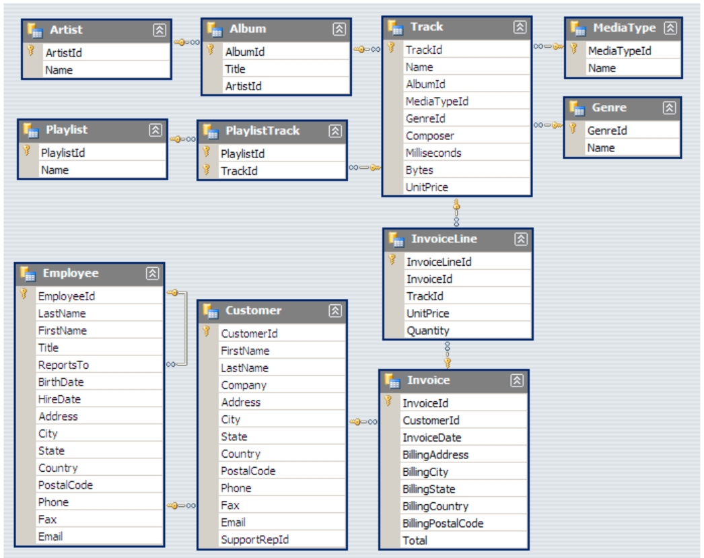

# 📊 SQL Music Store Analysis

## 🔍 Project Overview
This project analyzes a **digital music store’s relational database** to extract **actionable business insights using SQL**.

The objective is to simulate a **real-world Data Analyst workflow**, where structured data is queried to answer **revenue, customer behavior, and performance-related business questions**—without relying on visualization tools.

The project emphasizes:
- Query efficiency  
- Schema understanding  
- Analytical reasoning  

This makes it well-suited for **Data Analyst / Business Analyst fresher roles**.

---

## 🧩 Problem Statement
The music store aims to gain clarity on key business drivers, including:
- Identification of **highest-value customers**
- Revenue contribution by **music genres and artists**
- **Geographical sales performance** across countries and cities
- **Employee contribution** toward overall sales

---

## 🎯 Objectives
- Translate business questions into **SQL-based solutions**
- Write **optimized queries** using joins, subqueries, and CTEs
- Perform **customer, sales, and genre-level analysis**
- Convert raw query outputs into **meaningful business insights**

---

## 🗂 Dataset & Schema
The analysis is based on a **normalized relational database** consisting of the following tables:

- `Customer`
- `Invoice`
- `InvoiceLine`
- `Track`
- `Album`
- `Artist`
- `Genre`
- `Employee`

A detailed schema diagram (`MusicDatabaseSchema.png`) is included to illustrate **primary-key and foreign-key relationships**, enabling accurate and efficient multi-table joins.

---

## 📈 Key Analyses Performed
- Identification of **top-selling music genres**
- Analysis of **best customers by total spending**
- **Country-wise and city-wise revenue trends**
- Evaluation of **top-performing artists**
- Purchase behavior analysis using invoice data
- Assessment of **employee performance** based on sales support

---

## 🧠 SQL Concepts Demonstrated
- `INNER JOIN`, `LEFT JOIN`
- `GROUP BY` and `HAVING`
- Aggregate functions: `SUM`, `COUNT`, `AVG`
- Subqueries
- Common Table Expressions (CTEs)
- Sorting and filtering techniques

---

## 🛠 Technologies Used
- **SQL (PostgreSQL)**
- **pgAdmin**
- **Git & GitHub**

---

## 🔄 Project Workflow
1. Imported the database into the SQL environment  
2. Studied schema relationships and identified key entities  
3. Framed analytical questions from a **business perspective**  
4. Wrote and optimized SQL queries to address these questions  
5. Interpreted query outputs to derive **business-focused insights**

---
## 🔮 Future Improvements
- Integrate **Power BI / Tableau dashboards**
- Automate analysis using **Python (Pandas + SQLAlchemy)**
- Add KPI-based metrics such as **ARPU** and **CLV**
- Extend into a full **end-to-end analytics case study**

## 📁 Database Schema

### Database Schema

  

